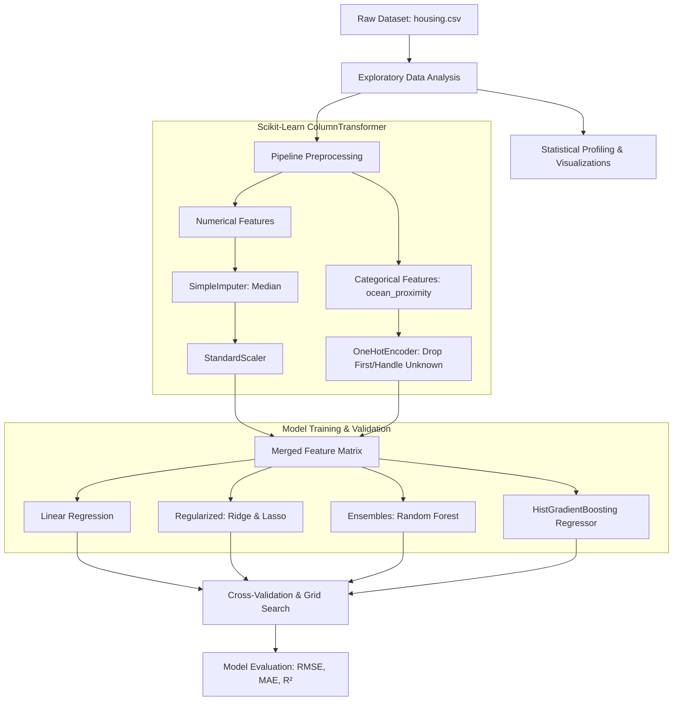

<div align="center">

# 🏡 California House Price Prediction

<p align="center">
  <strong>An end-to-end Machine Learning pipeline analyzing and predicting residential property values using the California Housing dataset.</strong>
</p>

[](https://www.python.org/)
[](https://scikit-learn.org/)
[](https://pandas.pydata.org/)
[](https://numpy.org/)
[](https://jupyter.org/)
[](LICENSE)
[](https://github.com/devloopcode/house_price_prediction)

[Explore Notebook](house_price_prediction.ipynb) • [Dataset](housing.csv) • [Report Bug](https://github.com/devloopcode/house_price_prediction/issues) • [Request Feature](https://github.com/devloopcode/house_price_prediction/issues)

</div>

---

## 📑 Table of Contents

- [Overview](#-overview)
- [Key Features](#-key-features)
- [Dataset Breakdown](#-dataset-breakdown)
- [Project Architecture & Workflow](#-project-architecture--workflow)
- [Exploratory Data Analysis (EDA)](#-exploratory-data-analysis-eda)
- [Modeling & Methodology](#-modeling--methodology)
- [Repository Structure](#-repository-structure)
- [Installation & Getting Started](#-installation--getting-started)
- [Usage Guide](#-usage-guide)
- [Roadmap & Enhancements](#-roadmap--enhancements)
- [Contributing](#-contributing)

---

## 📌 Overview

Accurately predicting residential property prices is a fundamental challenge in real estate analytics, urban planning, and financial risk assessment. 

This project implements an end-to-end **regression workflow** built upon the **California Housing Dataset** (derived from the 1990 U.S. Census). It covers in-depth Exploratory Data Analysis (EDA), robust preprocessing pipelines, missing value imputation, categorical feature encoding, and comparative benchmarking of multiple machine learning models—ranging from classical linear estimators to advanced ensemble gradient-boosted trees.

---

## ✨ Key Features

- **Comprehensive EDA**: Visual and statistical distribution analysis covering skewness, categorical frequencies, correlation dynamics, and geospatial patterns.
- **Robust Scikit-Learn Pipelines**: Modular preprocessing using `ColumnTransformer`, `StandardScaler`, `OneHotEncoder`, and `SimpleImputer` to prevent data leakage.
- **Multi-Model Benchmarking**:
  - Baseline Linear Regression (OLS)
  - Regularized Regression (Ridge, Lasso)
  - Non-linear Ensemble Methods (Random Forest Regressor, Histogram-based Gradient Boosting Regressor)
- **Standardized Evaluation Metrics**: Cross-validated scoring using Root Mean Squared Error (RMSE), Mean Absolute Error (MAE), and Coefficient of Determination ($R^2$).
- **Reproducible & Clean**: Deterministic configurations (`RANDOM_STATE = 42`) and structured dependency management via `requirements.txt`.

---

## 📊 Dataset Breakdown

The dataset contains **20,640 records** across California census block groups (districts), featuring 9 predictive variables and 1 continuous target variable (`median_house_value`).

| Feature | Type | Description | Unit / Range |
| :--- | :---: | :--- | :--- |
| `longitude` | Continuous | Geographic longitude coordinate | $\approx -124.35$ to $-114.31$ (West) |
| `latitude` | Continuous | Geographic latitude coordinate | $\approx 32.54$ to $41.95$ (North) |
| `housing_median_age` | Continuous | Median age of dwellings in block group | $1$ to $52$ years |
| `total_rooms` | Continuous | Total room count within the district block | $2$ to $39,320$ rooms |
| `total_bedrooms` | Continuous | Total bedroom count (contains 207 missing values) | $1$ to $6,445$ bedrooms |
| `population` | Continuous | Total number of residents in block group | $3$ to $35,682$ people |
| `households` | Continuous | Total number of household units in block group | $1$ to $6,082$ units |
| `median_income` | Continuous | Median household income within block group | Tens of thousands USD ($\approx \$5k - \$150k$) |
| `ocean_proximity` | Categorical | Proximity category to the Pacific coast / ocean | `<1H OCEAN`, `INLAND`, `NEAR OCEAN`, `NEAR BAY`, `ISLAND` |
| **`median_house_value`** | **Target** | **Median home value in district (target variable)** | **$\$14,999$ to $\$500,001$ USD (capped at $\$500k$)** |

> [!NOTE]
> - `median_income` is pre-scaled by the original census collectors where 1.0 represents roughly \$10,000 USD.
> - `median_house_value` exhibits an upper ceiling cap at **\$500,001**, which appears as a sharp frequency spike at the upper distribution boundary.
> - `total_bedrooms` has 207 missing entries ($\approx 1.0\%$), addressed systematically via median imputation within the training pipeline.

---

## 🔬 Project Architecture & Workflow



---

## 📈 Exploratory Data Analysis (EDA)

The notebook executes a thorough exploratory analysis:

1. **Target Distribution**:
   - `median_house_value` exhibits a right-skewed profile with a pronounced spike at \$500,000 due to artificial censoring in the survey collection methodology.
2. **Feature Distributions**:
   - 3×3 faceted subplots demonstrate that features like `total_rooms`, `total_bedrooms`, `population`, and `households` have long heavy tails, suggesting log-transformation or robust scaling benefits.
3. **Categorical Breakdown**:
   - `ocean_proximity` reveals substantial pricing disparities: properties located `<1H OCEAN` and `NEAR BAY` command significantly higher median valuations compared to `INLAND` districts.
4. **Geographic Correlation**:
   - High median values are heavily concentrated along coastal clusters (San Francisco Bay Area, Los Angeles, San Diego), indicating strong spatial dependencies between `latitude`, `longitude`, and price.

---

## 🤖 Modeling & Methodology

The pipeline evaluates multiple algorithms to strike an optimal balance between interpretability and predictive performance:

- **Baseline Linear Regression (OLS)**: Serves as the initial linear benchmark.
- **Ridge Regression ($L_2$ Regularization)**: Penalizes large regression coefficients to mitigate multicollinearity between correlated room/household metrics.
- **Lasso Regression ($L_1$ Regularization)**: Induces feature sparsity by zeroing out non-informative coefficients.
- **Random Forest Regressor**: Non-linear ensemble model capturing complex feature interactions and non-linear boundaries.
- **Histogram-based Gradient Boosting Regressor (`HistGradientBoostingRegressor`)**: Highly efficient gradient boosting algorithm optimized for continuous tabular features with built-in missing value handling.

### Evaluation Metrics
Performance is measured quantitatively using:
$$\text{RMSE} = \sqrt{\frac{1}{n} \sum_{i=1}^{n} (y_i - \hat{y}_i)^2}$$
$$\text{MAE} = \frac{1}{n} \sum_{i=1}^{n} |y_i - \hat{y}_i|$$
$$R^2 = 1 - \frac{\sum (y_i - \hat{y}_i)^2}{\sum (y_i - \bar{y})^2}$$

---

## 📁 Repository Structure

```text
house_price_prediction/
├── housing.csv                  # California Housing census dataset (20,640 records)
├── house_price_prediction.ipynb # Interactive notebook containing EDA, pipeline, and modeling
├── requirements.txt             # Project environment dependencies
└── README.md                    # Project documentation
```

---

## ⚙️ Installation & Getting Started

### Prerequisites
- Python **3.8+**
- `pip` or `conda` package manager

### 1. Clone the Repository
```bash
git clone https://github.com/devloopcode/house_price_prediction.git
cd house_price_prediction
```

### 2. Create and Activate a Virtual Environment

**Using `venv` (macOS / Linux):**
```bash
python3 -m venv venv
source venv/bin/activate
```

**Using `venv` (Windows PowerShell):**
```powershell
python -m venv venv
.\venv\Scripts\Activate.ps1
```

**Using `conda`:**
```bash
conda create -n housing-ml python=3.10 -y
conda activate housing-ml
```

### 3. Install Required Dependencies
```bash
pip install --upgrade pip
pip install -r requirements.txt
```

---

## 🚀 Usage Guide

Launch the interactive Jupyter environment to step through the analysis:

```bash
jupyter notebook house_price_prediction.ipynb
```

Alternatively, open the repository in **VS Code** or **Cursor** and select your active virtual environment kernel (`venv` or `housing-ml`) to execute notebook cells interactively.

---

## 🛣️ Roadmap & Enhancements

- [ ] **Feature Engineering**:
  - `rooms_per_household = total_rooms / households`
  - `bedrooms_per_room = total_bedrooms / total_rooms`
  - `population_per_household = population / households`
  - Cluster-based geospatial distance features (distance to nearest metropolitan center / coast)
- [ ] **Advanced Algorithms**: Benchmarking with XGBoost, LightGBM, and CatBoost.
- [ ] **Hyperparameter Optimization**: Systematic Bayesian search using `Optuna`.
- [ ] **Model Serving**: Interactive web demo using **Streamlit** or a REST API built with **FastAPI**.
- [ ] **Model Explainability**: SHAP (SHapley Additive exPlanations) and Partial Dependence Plots (PDP) for global and local interpretability.

---

## 🤝 Contributing

Contributions, feature suggestions, and pull requests are warmly welcomed!

1. Fork the Project (`gh repo fork devloopcode/house_price_prediction` or via GitHub web UI)
2. Create your Feature Branch (`git checkout -b feature/NewFeature`)
3. Commit your Changes (`git commit -m 'feat: Add cluster-based geospatial features'`)
4. Push to the Branch (`git push origin feature/NewFeature`)
5. Open a Pull Request

---


Developed by **[Med-IDBENOUAKRIM](https://github.com/devloopcode)**  
📧 Contact: [medidbenouakrim@gmail.com](mailto:medidbenouakrim@gmail.com)

---

<div align="center">
  <sub>⭐️ If you find this project helpful or educational, please consider giving it a star on GitHub!</sub>
</div>
